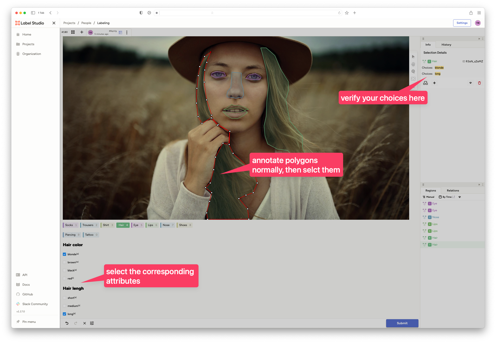
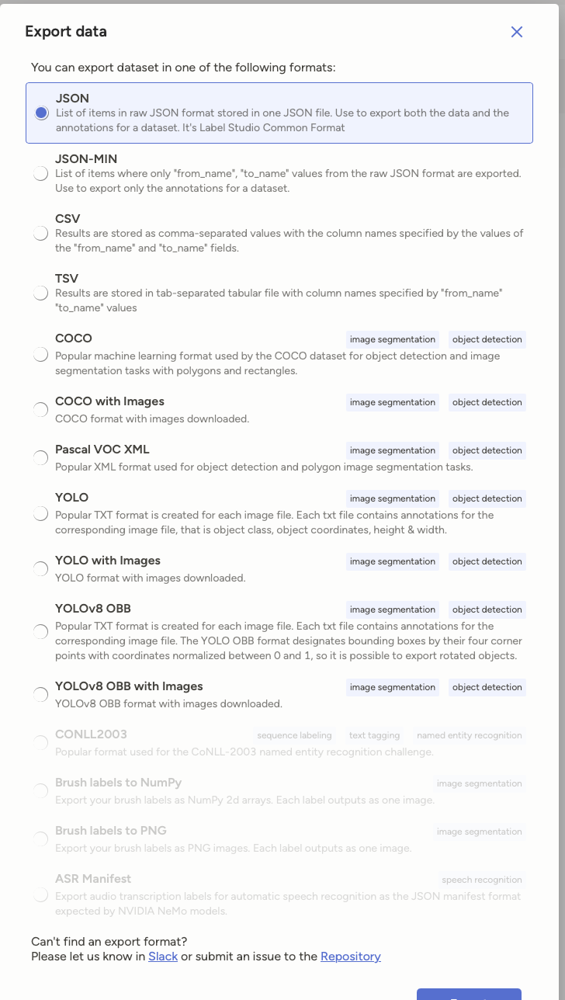
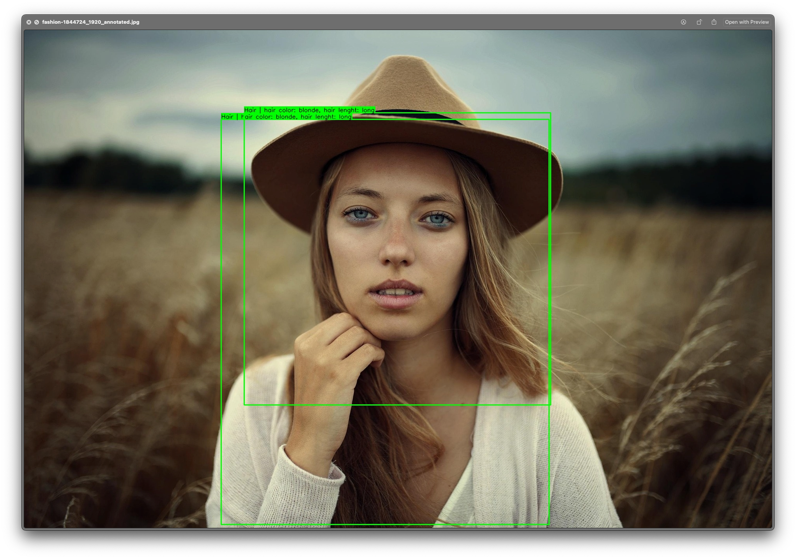

# YOLO PIPELINE TEMPLATE REPO

> *Disclaimer: I have no idea what I'm doing, most of this is vibe coded, thanks to ChatGPT. But I actually wrote this documentation by myself.*


**Goal:** Input Image(s) into the ML pipeline, segment the parts and then classify those parts.

> **Example:** Input a photo of a person. It detects (segment) hair, Eyes, Nose, Lips, etc. Those segments are then passed to a classifier, to detect hair color, hair length, eye color, Lip color, Nose size etc.

## Setup label studio

In your label studio project, configure the following label interface:

```html
<View>
  <Image name="image" value="$image"/>

  <PolygonLabels name="label" toName="image">
    <Label value="Socks"/>
    <Label value="Trousers"/>
    <Label value="Shirt"/>
    <Label value="Hair"/>
    <Label value="Eye"/>
    <Label value="Lips"/>
    <Label value="Nose"/>
    <Label value="Shoes"/>
  </PolygonLabels>
  
  <RectangleLabels name="rect_label" toName="image">
    <Label value="Piercing"/>
    <Label value="Tattoo"/>
  </RectangleLabels>

  
  <!-- hair color -->
  <Header value="Hair color" visibleWhenLabel="Hair"/>
  <Choices name="hair_color" toName="image" perRegion="true" visibleWhenLabel="Hair" choice="single">
    <Choice value="blonde"/>
    <Choice value="brown"/>
    <Choice value="black"/>
    <Choice value="red"/>
  </Choices>
  
          <!-- hair lenght -->
  <Header value="Hair lengh" visibleWhenLabel="Hair"/>
  <Choices name="hair_lenght" toName="image" perRegion="true" visibleWhenLabel="Hair" choice="single">
    <Choice value="short"/>
    <Choice value="medium"/>
    <Choice value="long"/>
  </Choices>
  
        <!-- eye color -->
  <Header value="eye color" visibleWhenLabel="Eye"/>
  <Choices name="eye_color" toName="image" perRegion="true" visibleWhenLabel="Eye" choice="single">
    <Choice value="green"/>
    <Choice value="brown"/>
    <Choice value="blue"/>
  </Choices>

  
          <!-- Socks type -->
  <Header value="Socks type" visibleWhenLabel="Socks"/>
  <Choices name="socks_type" toName="image" perRegion="true" visibleWhenLabel="Socks" choice="single">
    <Choice value="Short"/>
    <Choice value="Normal"/>
    <Choice value="Overknees"/>
  </Choices>
  
            <!-- Trousers type -->
  <Header value="Trousers type" visibleWhenLabel="Trousers"/>
  <Choices name="Trousers_type" toName="image" perRegion="true" visibleWhenLabel="Trousers" choice="single">
    <Choice value="long"/>
    <Choice value="Jeans"/>
    <Choice value="Shorts"/>
    <Choice value="Hot Pants"/>
    <Choice value="Skirt"/>
  </Choices>
  
              <!-- Shirt type -->
  <Header value="Shirt type" visibleWhenLabel="Trousers"/>
  <Choices name="shirt_type" toName="image" perRegion="true" visibleWhenLabel="Shirt" choice="single">
    <Choice value="Shirt"/>
    <Choice value="T-Shirt"/>
    <Choice value="Jumper"/>
    <Choice value="Dress"/>
  </Choices>
  
    <!-- hair color -->
  <Header value="Lip color" visibleWhenLabel="Lips"/>
  <Choices name="lips_color" toName="image" perRegion="true" visibleWhenLabel="Lips" choice="single">
    <Choice value="Red"/>
    <Choice value="pink"/>
    <Choice value="black"/>
    <Choice value="brown"/>
    <Choice value="lila"/>
  </Choices>
  
            <!-- Nose size -->
  <Header value="Nose size" visibleWhenLabel="Nose"/>
  <Choices name="nose_size" toName="image" perRegion="true" visibleWhenLabel="Nose" choice="single">
    <Choice value="small"/>
    <Choice value="medium"/>
    <Choice value="big"/>
  </Choices>
  
              <!-- Shoes type -->
  <Header value="Shoe Type" visibleWhenLabel="Shoes"/>
  <Choices name="shoe_type" toName="image" perRegion="true" visibleWhenLabel="Shoes" choice="single">
    <Choice value="Sneakers"/>
    <Choice value="Chcuks"/>
    <Choice value="Dress shoes"/>
    <Choice value="High heels"/>
    <Choice value="sandals"/>
  </Choices>
  
              <!-- Piercing type -->
  <Header value="Piercing Type" visibleWhenLabel="Piercing"/>
  <Choices name="piercing_type" toName="image" perRegion="true" visibleWhenLabel="Piercing" choice="single">
    <Choice value="Nose"/>
    <Choice value="Earrings"/>
    <Choice value="Tongue"/>
    <Choice value="Lip"/>
  </Choices>
  
</View>
```

This makes use of polygons, as we already now it, but also rectangle, to simplify annotating certain elements. Then we add choices to some of the classes, to difference further. We later train different classify models on this. 

## Annotate and classify.

Annotate as we did in the past in label studio, but this time, select attributes from the list below, for example:

> Image by <a href="https://pixabay.com/users/pexels-2286921/?utm_source=link-attribution&utm_medium=referral&utm_campaign=image&utm_content=1844724">Pexels</a> from <a href="https://pixabay.com//?utm_source=link-attribution&utm_medium=referral&utm_campaign=image&utm_content=1844724">Pixabay</a> 
> **IMPORTANT**: I only use this image as illustriation purpuse, so I don't have to include an image of myself. Do not train any models of/from someone you don't have consent from. 

After that, export the data, but as "JSON":




## Prepare your working directory

Make sure you have a folder, that is not synced to a cloud provider (eg. iCloud Drive, OneDrive, etc.) as I faced issues during training, when certain files were unavailable .
You can clone my git repository, so you have all scripts and the correct folder strucutre:
```shell
# 1st cd <your_top_level_folder>
git clone https://github.com/jhuesser/yolo-pipeline <your_project_name>
```

This will create the `<your_project_name>` folder, where you can `cd`into it.
We then setup our python virtual environment and activate it:

```shell
# cd <your_project> if you haven't already done it
python3 -m venv venv
source venv/bin/activate
```

Now we need to install all dependencies using `pip`. You can use the `requirements.txt`for that:
```shell
pip install -r requirements.txt
```

Now copy your exported `JSON` file from label studio to the `label-studio-export` folder in your project folder.

You also need the original images - as they are in label studio (same filename etc.). Copy them into the `images`folder in your project. I always export the project with the `YOLO with images` option as well, and copy the images from there, as we need to train the segmentation model anyway.

Your directory structure should now look like this:

```
├── README.md
├── **images**
│   ├── 268a614a-IMG_3972.jpeg
│   ├── 28809637-IMG_7439.jpeg
│   ├── 4b8842f1-IMG_7211.jpeg
│   ├── 5d320d14-IMG_6957.jpeg
│   └── c7e8c3fa-IMG_7542.jpeg
├── **label-studio-export**
│   └── persons.json
├── **output**
├── requirements.txt
└── **scripts**
    ├── batch_trainer.py
    ├── prepare_dataset.py
    └── splitter.py
  
5 directories, 11 files
```

> Note: I have omitted the venv directory, as this is managed by python. If you want to verify, you can run `tree -I venv` in the terminal
## Split the attributes

Now we're ready to prepare the dataset for classification training. The good news is, that we don't need to rely on the segmentation model to get our training data right, as we annotated everything already! So we can just mask the polygons and get our categories.
We use the  `prepare_dataset.py` script for this.

This script will get all the classes and their attributes from the JSON export. In the `output`folder it then creates a directory for each class and a subdirectory for all of its attributes.

Usage:
```shell
python scripts/prepare_dataset.py --labelstudio-json label-studio-export/<your_json_export_filename>.json --images-dir images --output-dir output
```

> There are other parameters as well, that are optional, check with --help

After the preparation your folder structure should look like this:
```
.
├── README.md
├── images
│   ├── 268a614a-IMG_3972.jpeg
│   ├── 28809637-IMG_7439.jpeg
│   ├── 4b8842f1-IMG_7211.jpeg
│   ├── 5d320d14-IMG_6957.jpeg
│   └── c7e8c3fa-IMG_7542.jpeg
├── label-studio-export
│   └── persons.json
├── output
│   ├── Nose
│   │   └── unspecified
│   │       └── 268a614a-IMG_3972_y8KA74Ai5Q.jpg
│   ├── Tattoo
│   │   └── unspecified
│   │       ├── 268a614a-IMG_3972_6GgyR0w-Sa.jpg
│   │       ├── 268a614a-IMG_3972_mf6cj-E9go.jpg
│   │       └── 268a614a-IMG_3972_vh-R-IoI5R.jpg
│   ├── eye_color
│   │   ├── blue
│   │   │   ├── 268a614a-IMG_3972_8MRNrYMXHj.jpg
│   │   │   ├── 268a614a-IMG_3972_VJqoN8hQWT.jpg
│   │   │   ├── 28809637-IMG_7439_Cs4VE5m_4C.jpg
│   │   │   └── 28809637-IMG_7439_mZoCUMBEb9.jpg
│   │   └── brown
│   │       ├── 4b8842f1-IMG_7211_P7HDs_rE7y.jpg
│   │       ├── 4b8842f1-IMG_7211_UYWPfBAmyl.jpg
│   │       ├── 5d320d14-IMG_6957_D5_uqyaKjj.jpg
│   │       ├── 5d320d14-IMG_6957_lsBHItzI_e.jpg
│   │       ├── c7e8c3fa-IMG_7542_UesHBXIhQ6.jpg
│   │       └── c7e8c3fa-IMG_7542_UkmHkmtU4B.jpg
│   ├── hair_color
│   │   ├── blonde
│   │   │   └── 28809637-IMG_7439_j-xeQM3NY3.jpg
│   │   ├── brown
│   │   │   ├── 4b8842f1-IMG_7211_txy-p9KD-d.jpg
│   │   │   ├── 5d320d14-IMG_6957_Hq5UwlIKJi.jpg
│   │   │   └── c7e8c3fa-IMG_7542_3xlshpgcMC.jpg
│   │   └── red
│   │       └── 268a614a-IMG_3972_ifPiemirGY.jpg
│   ├── hair_lenght
│   │   ├── long
│   │   │   ├── 268a614a-IMG_3972_ifPiemirGY.jpg
│   │   │   ├── 4b8842f1-IMG_7211_txy-p9KD-d.jpg
│   │   │   ├── 5d320d14-IMG_6957_Hq5UwlIKJi.jpg
│   │   │   └── c7e8c3fa-IMG_7542_3xlshpgcMC.jpg
│   │   └── short
│   │       └── 28809637-IMG_7439_j-xeQM3NY3.jpg
│   ├── lips_color
│   │   └── pink
│   │       ├── 268a614a-IMG_3972_6okV57y70f.jpg
│   │       ├── 28809637-IMG_7439_y7FVxdM2I1.jpg
│   │       ├── 4b8842f1-IMG_7211_CFa0ubZqxP.jpg
│   │       ├── 5d320d14-IMG_6957_kBD3f2vKRm.jpg
│   │       └── c7e8c3fa-IMG_7542_T560Rh9XoM.jpg
│   ├── nose_size
│   │   ├── big
│   │   │   ├── 4b8842f1-IMG_7211_DrrMvEoEKH.jpg
│   │   │   ├── 5d320d14-IMG_6957_fNROkFuqz5.jpg
│   │   │   └── c7e8c3fa-IMG_7542_rBpayAGoWi.jpg
│   │   └── medium
│   │       └── 28809637-IMG_7439_WqoLG67iNK.jpg
│   └── piercing_type
│       ├── Earrings
│       │   └── 268a614a-IMG_3972_RWmfJ1peHz.jpg
│       └── Nose
│           ├── 268a614a-IMG_3972_K3rhHCYBVM.jpg
│           └── 28809637-IMG_7439_a6Meo2d-1E.jpg
├── requirements.txt
└── scripts
    ├── batch_trainer.py
    ├── prepare_dataset.py
    └── splitter.py

27 directories, 47 files
```

Regarding the `unspecified`folders: If they appear in a class that has attributes, you forgot to classify those. If they appear in a class without attributes (eg. Tattoo in this example), don't worry, those get ignored and just classified as the initial class.

## Prepare train/val

We now need to split the data into `train` and `val`folders, so we can train the model. This is done with the `splitter.py` script:

```shell
python script/splitter.py --dataset-root output
```

> There are other parameters, that are optional. check with --help

Your directory structure in the output folder now looks like this:

```
output
├── Nose
│   └── unspecified
│       └── 268a614a-IMG_3972_y8KA74Ai5Q.jpg
├── Tattoo
│   └── unspecified
│       ├── 268a614a-IMG_3972_6GgyR0w-Sa.jpg
│       ├── 268a614a-IMG_3972_mf6cj-E9go.jpg
│       └── 268a614a-IMG_3972_vh-R-IoI5R.jpg
├── eye_color
│   ├── blue
│   │   ├── 268a614a-IMG_3972_8MRNrYMXHj.jpg
│   │   ├── 268a614a-IMG_3972_VJqoN8hQWT.jpg
│   │   ├── 28809637-IMG_7439_Cs4VE5m_4C.jpg
│   │   └── 28809637-IMG_7439_mZoCUMBEb9.jpg
│   ├── brown
│   │   ├── 4b8842f1-IMG_7211_P7HDs_rE7y.jpg
│   │   ├── 4b8842f1-IMG_7211_UYWPfBAmyl.jpg
│   │   ├── 5d320d14-IMG_6957_D5_uqyaKjj.jpg
│   │   ├── 5d320d14-IMG_6957_lsBHItzI_e.jpg
│   │   ├── c7e8c3fa-IMG_7542_UesHBXIhQ6.jpg
│   │   └── c7e8c3fa-IMG_7542_UkmHkmtU4B.jpg
│   ├── train
│   │   ├── blue
│   │   │   ├── 268a614a-IMG_3972_VJqoN8hQWT.jpg
│   │   │   ├── 28809637-IMG_7439_Cs4VE5m_4C.jpg
│   │   │   └── 28809637-IMG_7439_mZoCUMBEb9.jpg
│   │   └── brown
│   │       ├── 4b8842f1-IMG_7211_P7HDs_rE7y.jpg
│   │       ├── 5d320d14-IMG_6957_D5_uqyaKjj.jpg
│   │       ├── 5d320d14-IMG_6957_lsBHItzI_e.jpg
│   │       └── c7e8c3fa-IMG_7542_UesHBXIhQ6.jpg
│   └── val
│       ├── blue
│       │   └── 268a614a-IMG_3972_8MRNrYMXHj.jpg
│       └── brown
│           ├── 4b8842f1-IMG_7211_UYWPfBAmyl.jpg
│           └── c7e8c3fa-IMG_7542_UkmHkmtU4B.jpg
├── hair_color
│   ├── blonde
│   │   └── 28809637-IMG_7439_j-xeQM3NY3.jpg
│   ├── brunette
│   │   ├── 4b8842f1-IMG_7211_txy-p9KD-d.jpg
│   │   ├── 5d320d14-IMG_6957_Hq5UwlIKJi.jpg
│   │   └── c7e8c3fa-IMG_7542_3xlshpgcMC.jpg
│   ├── red
│   │   └── 268a614a-IMG_3972_ifPiemirGY.jpg
│   ├── train
│   │   ├── blonde
│   │   ├── brunette
│   │   │   ├── 5d320d14-IMG_6957_Hq5UwlIKJi.jpg
│   │   │   └── c7e8c3fa-IMG_7542_3xlshpgcMC.jpg
│   │   └── red
│   └── val
│       ├── blonde
│       │   └── 28809637-IMG_7439_j-xeQM3NY3.jpg
│       ├── brunette
│       │   └── 4b8842f1-IMG_7211_txy-p9KD-d.jpg
│       └── red
│           └── 268a614a-IMG_3972_ifPiemirGY.jpg
├── hair_lenght
│   ├── long
│   │   ├── 268a614a-IMG_3972_ifPiemirGY.jpg
│   │   ├── 4b8842f1-IMG_7211_txy-p9KD-d.jpg
│   │   ├── 5d320d14-IMG_6957_Hq5UwlIKJi.jpg
│   │   └── c7e8c3fa-IMG_7542_3xlshpgcMC.jpg
│   ├── short
│   │   └── 28809637-IMG_7439_j-xeQM3NY3.jpg
│   ├── train
│   │   ├── long
│   │   │   ├── 4b8842f1-IMG_7211_txy-p9KD-d.jpg
│   │   │   ├── 5d320d14-IMG_6957_Hq5UwlIKJi.jpg
│   │   │   └── c7e8c3fa-IMG_7542_3xlshpgcMC.jpg
│   │   └── short
│   └── val
│       ├── long
│       │   └── 268a614a-IMG_3972_ifPiemirGY.jpg
│       └── short
│           └── 28809637-IMG_7439_j-xeQM3NY3.jpg
├── lips_color
│   ├── pink
│   │   ├── 268a614a-IMG_3972_6okV57y70f.jpg
│   │   ├── 28809637-IMG_7439_y7FVxdM2I1.jpg
│   │   ├── 4b8842f1-IMG_7211_CFa0ubZqxP.jpg
│   │   ├── 5d320d14-IMG_6957_kBD3f2vKRm.jpg
│   │   └── c7e8c3fa-IMG_7542_T560Rh9XoM.jpg
│   ├── train
│   │   └── pink
│   │       ├── 28809637-IMG_7439_y7FVxdM2I1.jpg
│   │       ├── 4b8842f1-IMG_7211_CFa0ubZqxP.jpg
│   │       ├── 5d320d14-IMG_6957_kBD3f2vKRm.jpg
│   │       └── c7e8c3fa-IMG_7542_T560Rh9XoM.jpg
│   └── val
│       └── pink
│           └── 268a614a-IMG_3972_6okV57y70f.jpg
├── nose_size
│   ├── big
│   │   ├── 4b8842f1-IMG_7211_DrrMvEoEKH.jpg
│   │   ├── 5d320d14-IMG_6957_fNROkFuqz5.jpg
│   │   └── c7e8c3fa-IMG_7542_rBpayAGoWi.jpg
│   ├── medium
│   │   └── 28809637-IMG_7439_WqoLG67iNK.jpg
│   ├── train
│   │   ├── big
│   │   │   ├── 4b8842f1-IMG_7211_DrrMvEoEKH.jpg
│   │   │   └── c7e8c3fa-IMG_7542_rBpayAGoWi.jpg
│   │   └── medium
│   └── val
│       ├── big
│       │   └── 5d320d14-IMG_6957_fNROkFuqz5.jpg
│       └── medium
│           └── 28809637-IMG_7439_WqoLG67iNK.jpg
└── piercing_type
    ├── Earrings
    │   └── 268a614a-IMG_3972_RWmfJ1peHz.jpg
    ├── Nose
    │   ├── 268a614a-IMG_3972_K3rhHCYBVM.jpg
    │   └── 28809637-IMG_7439_a6Meo2d-1E.jpg
    ├── train
    │   ├── Earrings
    │   └── Nose
    │       └── 28809637-IMG_7439_a6Meo2d-1E.jpg
    └── val
        ├── Earrings
        │   └── 268a614a-IMG_3972_RWmfJ1peHz.jpg
        └── Nose
            └── 268a614a-IMG_3972_K3rhHCYBVM.jpg

59 directories, 68 files
```

Note, that under each class, we now have the `train` and `val` folder which itself contain the attributes again. Surely, there is a better way of handling this, but this is a future problem.

## Train the classifier

> Note: You should have much more images to get good results. I just recreated this example project, because my working directory is messy, you know how it is.

Now it's time to actually train this thing. You can use `batch_trainer.py` to train classification for all attributes. 

> Todo: Rewrite the script, so it uses the yolo library to start training, instead of calling the shell command - Vibe coding FTW.

Usage:

```shell 
python scripts/batch_trainer.py --output-root output
```

> Note: There are other optional parameters as well, check --help. If you're not on Apple Silicon you need to modify the --device parameter to `cpu` IIRC (or your GPU of course).

## Train the segmentation model

Nothing new here. In the previously downloaded `YOLO with Images` export just run your training as in the pure segmentation projects:

```shell
yolo task=segment mode=train model=yolov8n-seg.pt data=dataset.yaml epochs=100 imgsz=640 device=mps
```

## Collect the models

> TODO: Write a script that does this automatically

> Note: From this step on, I'm still in the PoC phase, so some scripts are missing and manual work is still required.

In your segmentation project you should now have the model at `runs/segmentation/train/weights/best.pt` Copy it to the classifier project in `models/segmentation/` and give it a name.

Then in your classifier project you now have various trainN folders (where N is the number of the run) at `runs/classify/`. In those folders there are also the models in `weights/best.pt` copy them to `models/classifiers` and name them according to the attributes, **This is important!**. 

So for example, if the model for `hair_color` is in `runs/classify/train4/weights/best.pt` copy the `best.pt`to `models/classifiers/hair_color.pt`.

## Let's run the pipeline!


Use the `pipeline.py` to run the pipeline against an image or directory of image. In the default config results are saved to the `results`folder.


```shell
python pipeline.py --seg-model models/segmentation/yoursegmodel.pt --classifiers-dir models/classifiers --input /path/to/your/images 

> Note: There are more optional parameters, check with --help
```

You then receive a JSON file with the regions defined and an image where the results are drawn into for visual confirmations:


> Image by <a href="https://pixabay.com/users/pexels-2286921/?utm_source=link-attribution&utm_medium=referral&utm_campaign=image&utm_content=1844724">Pexels</a> from <a href="https://pixabay.com//?utm_source=link-attribution&utm_medium=referral&utm_campaign=image&utm_content=1844724">Pixabay</a> 
> **IMPORTANT**: I only use this image as illustriation purpuse, so I don't have to include an image of myself. Do not train any models of/from someone you don't have consent from. 


> **Note:** The hair was dedected 2 times, one time on the left side of the face and one time on the right side of the face, that's why it shows 2x. Also this is a quick and dirty PoC training set with only 5 images in the training set. you should have more. This image was not in the training set.


## Next steps

Next steps: Once that thing works exactly as I need it, I want to built a wrapper around it, maybe a Flask app or something like this, so I can pass images via API requests.
